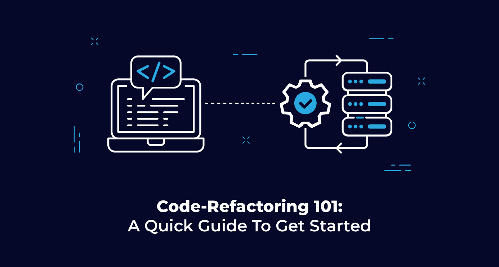

<!-- PROJECT LOGO -->
 

  

<h3 align="center">Code Refactor: Horiseon</h3>

<!-- TABLE OF CONTENTS -->

  
Table of Contents

  <ol>
    <li>
      <a href="#about-the-project">About The Project</a>
      <ul>
        <li><a href="#built-with">Built With</a></li>
      </ul>
    </li>
    <li>
      <a href="#getting-started">Getting Started</a>
      <ul>
        <li><a href="#prerequisites">Prerequisites</a></li>
        <li><a href="#installation">Installation</a></li>
      </ul>
    </li>
    <li><a href="#usage">Usage</a></li>
    <li><a href="#roadmap">Roadmap</a></li>
    <li><a href="#contributing">Contributing</a></li>
    <li><a href="#license">License</a></li>
    <li><a href="#contact">Contact</a></li>
    <li><a href="#acknowledgments">Acknowledgments</a></li>
  </ol>

<!-- ABOUT THE PROJECT -->
## About The Project

I was given the task of taking an existing code and refactoring it to meet a certain set of standards and functionality. Horiseon marketing agency needed its exisitng site code refactored. 

(<a href="#top">back to top</a>)

### Built With

* VScode
* HTML
* CSS

(<a href="#top">back to top</a>)

<!-- GETTING STARTED -->
## Getting Started

Given a webpage that meets accessibility standards, I view the source code to make sure it meets the semantic HTML elements.I viewed. the structure of the HTML elements and find that the elements follow a logical structure independent of styling and positioning. When viewing the icon and image elements, I make sure there are accessible alt attributes. Then taking a look at the heading attributes; I find that they fall in sequential order. I view the title element, and I find a concise, descriptive title.

#

(<a href="#top">back to top</a>)

<!-- USAGE EXAMPLES -->
## Usage

Web accessibility is an increasingly important consideration for businesses. It ensures that people with disabilities can access a website using assistive technologies such as video captions, screen readers, and braille keyboards. Making a website accessible is also good for business for many reasons, one of them being that accessible sites are better positioned in search engines like Google. It also helps companies avoid litigation that can occur when people with disabilities can't access their website.

(<a href="#top">back to top</a>)

<!-- CONTACT -->
## Contact

John Harris: John.harris7292@gmail.com

Project Link: [https://jharris92.github.io/horiseon_challenge/]
(https://github.com/jharris92/horiseon_challenge.git)

(<a href="#top">back to top</a>)

<!-- ACKNOWLEDGMENTS -->
## Acknowledgments

* [Columbia Coding Bootcamp]

(<a href="#top">back to top</a>)

